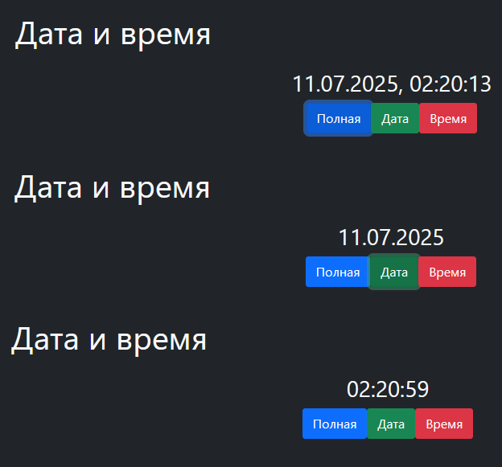

# 

Cайт-приложение "Дата и время", предназначенное для отображения текущих даты и времени в разных форматах.

- При открытии сайта по центру экрана отображается текущее время (по умолчанию — полный формат).
- Под временем расположены три кнопки:
- Полная — показывает дату и время (например, 11.07.2025, 12:34:56).
- Дата — показывает только дату (например, 11.07.2025).
- Время — показывает только время (например, 12:34:56).
- Время обновляется автоматически каждую секунду.
- При нажатии на любую из кнопок меняется формат отображения.
#### Особенности
- Адаптивная верстка (корректно отображается на разных устройствах).
- Время обновляется автоматически без перезагрузки страницы.
- Нет сторонних зависимостей, кроме Bootstrap (через CDN).
- Всё работает на стороне клиента, без серверной части.

