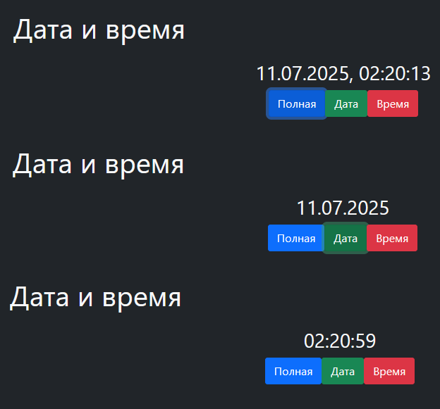

 
# https://bubenture.github.io/date

A web application designed to display the current date and time in various formats.

- When the site is opened, the current time is displayed in the center of the screen (default is the full format).
- Below the time, there are three buttons:
  - **Full** — shows the date and time (e.g., 11.07.2025, 12:34:56).
  - **Date** — shows only the date (e.g., 11.07.2025).
  - **Time** — shows only the time (e.g., 12:34:56).
- The time updates automatically every second.
- Clicking any of the buttons changes the display format.

#### Features
- Responsive layout (displays correctly on different devices).
- Time updates automatically without reloading the page.
- No external dependencies except for Bootstrap (via CDN).
- Everything operates on the client side, with no server component.
